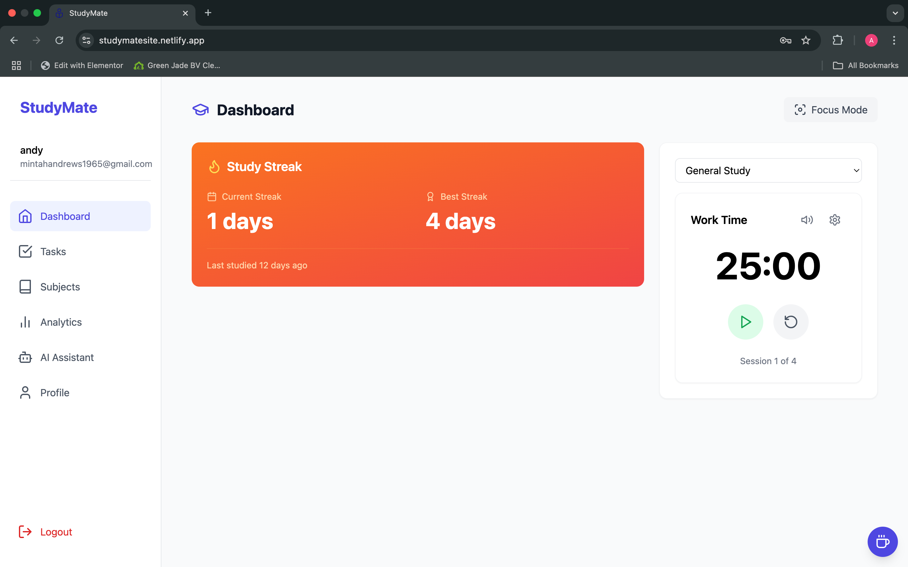

# 📚 StudyMate - Your AI-Powered Study Companion

> Transform your study sessions with intelligent task management, real-time progress tracking, and AI-powered learning assistance.

[](https://studymatesite.netlify.app)
[](https://github.com/mintahandrews/studymate)
[](LICENSE)



## ✨ Features

- 🤖 **AI Study Assistant** - Get instant help with your study materials
- ⏱️ **Smart Study Timer** - Track your study sessions with Pomodoro technique
- 📊 **Progress Analytics** - Visualize your study habits and improvements
- 📝 **Task Management** - Organize your assignments and deadlines
- 📚 **Subject Tracking** - Monitor progress across different subjects
- 🎯 **Study Goals** - Set and achieve your study targets

## 🚀 Key Technologies

- React 18 with TypeScript
- Google's Gemini AI API
- Supabase for Backend
- TailwindCSS for Styling
- PDF.js & Mammoth for Document Processing
- Web Speech API for Voice Input

## 🛠️ Quick Start

### Prerequisites

- Node.js (v18 or higher)
- npm or yarn
- A modern web browser

### Installation

1. Clone the repository

```bash
git clone https://github.com/mintahandrews/studymate.git
cd studymate
```

2. Install dependencies

```bash
npm install
# or
yarn install
```

3. Set up environment variables
   Create a `.env` file in the root directory:

```env
VITE_SUPABASE_URL=your_supabase_url
VITE_SUPABASE_ANON_KEY=your_supabase_anon_key
VITE_GEMINI_API_KEY=your_gemini_api_key
```

4. Start the development server

```bash
npm run dev
# or
yarn dev
```

5. Open [http://localhost:5173](http://localhost:5173) in your browser

### Building for Production

```bash
npm run build
# or
yarn build
```

## 🛠️ Tech Stack

- **Frontend Framework**: React with TypeScript
- **Styling**: Tailwind CSS
- **State Management**: React Context
- **Router**: React Router
- **AI Integration**: Google Generative AI
- **Backend/Auth**: Supabase
- **Build Tool**: Vite
- **Package Manager**: npm/yarn
- **Icons**: Lucide React
- **Notifications**: react-hot-toast
- **Date Handling**: date-fns
- **File Parsing**:
  - PDF.js (PDF files)
  - Mammoth (Word documents)
- **Code Highlighting**: react-syntax-highlighter
- **Markdown**: react-markdown with remark-gfm

## 📁 Project Structure

```
studymate/
├── public/
│   └── sounds/          # Notification sound files
├── src/
│   ├── components/      # React components
│   ├── contexts/        # React contexts
│   ├── pages/           # Page components
│   ├── utils/           # Utility functions
│   └── types.ts         # TypeScript types
├── .env                 # Environment variables
└── package.json         # Dependencies and scripts
```

## 🔑 Key Components

### Task Management

- `TaskList.tsx`: Main task management component
- `SubjectManager.tsx`: Subject management interface
- `TaskForm.tsx`: Task creation/editing form

### Timer Components

- `PomodoroTimer.tsx`: Pomodoro technique timer
- `StudyTimer.tsx`: Simple study session timer

### AI Integration

- `AiAssistant.tsx`: AI-powered study assistant
- `ChatInterface.tsx`: Chat interface for AI interaction

## 🎨 Customization

### Theme

The app uses Tailwind CSS for styling. Customize the theme in `tailwind.config.js`:

```javascript
module.exports = {
  theme: {
    extend: {
      colors: {
        // Your custom colors
      },
    },
  },
};
```

### Timer Settings

Modify default timer settings in the respective components:

- `PomodoroTimer.tsx`: Default work/break durations
- `StudyTimer.tsx`: Default session duration

## 📝 License

This project is licensed under the MIT License - see the [LICENSE](licensee.md) file for details.

## 🤝 Contributing

Contributions are welcome! Please feel free to submit a Pull Request.

1. Fork the repository
2. Create your feature branch (`git checkout -b feature/AmazingFeature`)
3. Commit your changes (`git commit -m 'Add some AmazingFeature'`)
4. Push to the branch (`git push origin feature/AmazingFeature`)
5. Open a Pull Request

## 🐛 Bug Reports

If you find a bug, please open an issue with:

- A clear description of the bug
- Steps to reproduce
- Expected behavior
- Screenshots if applicable

## 🙏 Acknowledgments

- Sound effects from [Freesound](https://freesound.org/)
- Icons from [Lucide](https://lucide.dev/)

## 👨‍💻 Developer

Developed by [codemintah](https://github.com/mintahandrews)

---

Made with ❤️ for students everywhere
